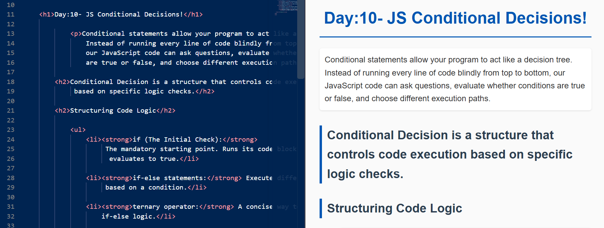
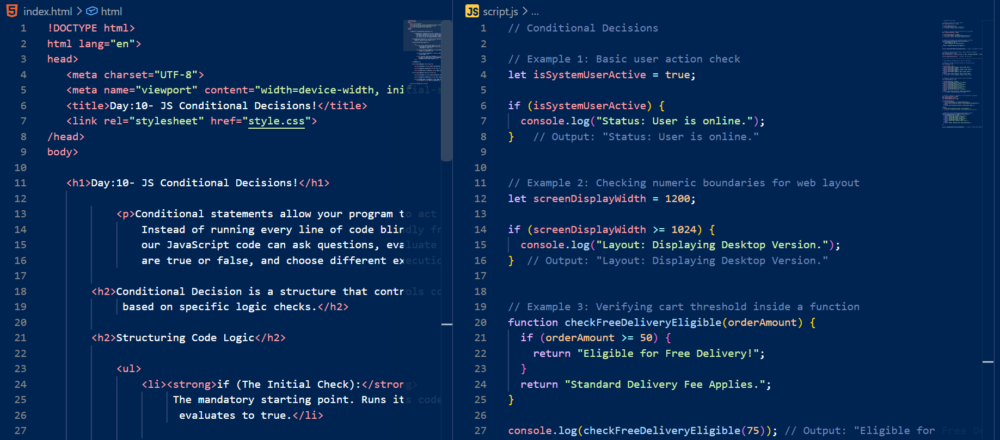
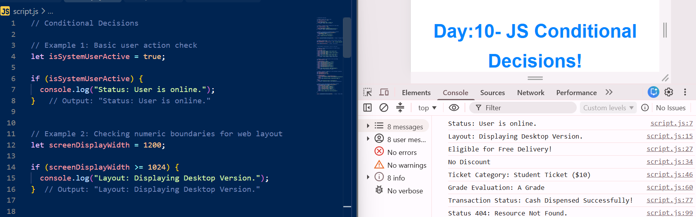
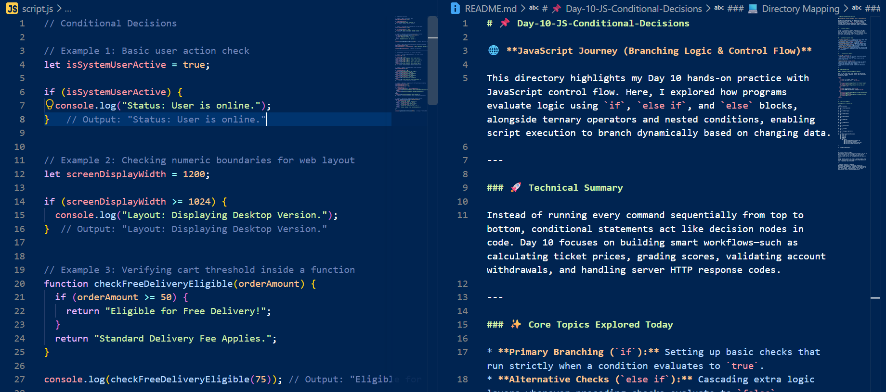

# 📌 Day-10-JS-Conditional-Decisions

🌐 **JavaScript Journey (Branching Logic & Control Flow)**

This directory highlights my Day 10 hands-on practice with JavaScript control flow. Here, I explored how programs evaluate logic using `if`, `else if`, and `else` blocks, alongside ternary operators and nested conditions, enabling script execution to branch dynamically based on changing data.

---

### 🚀 Technical Summary

Instead of running every command sequentially from top to bottom, conditional statements act like decision nodes in code. Day 10 focuses on building smart workflows—such as calculating ticket prices, grading scores, validating account withdrawals, and handling server HTTP response codes.

---

### ✨ Core Topics Explored Today

* **Primary Branching (`if`):** Setting up basic checks that run strictly when a condition evaluates to `true`.
* **Alternative Checks (`else if`):** Cascading extra logic layers whenever preceding checks evaluate to `false`.
* **Fallback Executions (`else`):** Defining default action blocks that run automatically when all previous tests fail.
* **Inline Ternary Shorthand:** Writing clean, single-line condition checks for simple two-way outcomes.
* **Nested Control Logic:** Placing conditional blocks inside other `if` statements to handle multi-step verifications like ATM transactions.

---

### 🛠️ File Structure Details

**HTML Page (`index.html`)**
* Displays simple guide text outlining conditional keywords (`if`, `else if`, `else`, ternary).
* Summarizes condition rules and links directly to the external logic script.

**JavaScript Script (`script.js`)**
* Features realistic examples including screen size checks, free shipping rules, grade calculations, ticket pricing brackets, and HTTP server status handlers.
* Prints every evaluated outcome directly to the browser console.

---

### 📷 Documented Proof

#### 🎨 Workspace Screenshots & Browser Outputs

Below are the visual proof files showing the web preview, source code workspace, developer console logs, and project documentation layout.

<table>
  <tr>
    <td><b>1. HTML Browser View</b></td>
    <td><b>2. Code Setup (HTML & JS)</b></td>
  </tr>
  <tr>
    <td></td>
    <td></td>
  </tr>
  <tr>
    <td><b>3. Console Output Logs</b></td>
    <td><b>4. README Documentation Workspace</b></td>
  </tr>
  <tr>
    <td></td>
    <td></td>
  </tr>
</table>

---

### 💻 Directory Mapping

#### Repository Structure Tree

```text
JavaScript-Journey/
│
├── Day-1-JS-Introduction/
│   └── ...
│
├── Day-2-JS-Data-Types/
│   └── ...
│
├── Day-3-JS-Variables/
│   └── ...
│
├── Day-4-JS-Let-Const/
│   └── ...
│
├── Day-5-JS-String/
│   └── ...
│
├── Day-6-JS-Operators/
│   └── ...
│
├── Day-7-JS-Functions/
│   └── ...
│
├── Day-8-JS-Scope/
│   └── ...
│
├── Day-9-JS-Logical-Operators/
│   └── ...
│
└── Day-10-JS-Conditional-Decisions/
    ├── index.html
    ├── style.css
    ├── script.js
    ├── README.md
    └── assets/
        └── images/
            ├── Day-10-html-browser-output.png
            ├── Day-10-html-js-code.png
            ├── Day-10-js-code-console-output.png
            └── Day-10-js-readme-structure.png

---

🔗  Live Build Deployment: [https://github.com/asima-waheed/JavaScript-Journey/tree/main/Day-10-JS-Conditional-Decisions ]


---

🌱 Technical Growth & Insights
Understanding conditional execution has helped me see how web applications handle real user inputs and varied system states. Writing clear if-else trees and clean ternary statements makes my code far more predictable and easier to debug.

Through regular practice and Allah's ongoing guidance, I am feeling more confident converting complex requirements into clean programming logic every day!

---

⭐ Community Connection & Feedback
If you have suggestions on structuring control flow, optimizing code readability, or are also following a daily programming routine, I would love to connect! Feel free to share your thoughts, open a discussion, or star this repository to track my continuous progression.
