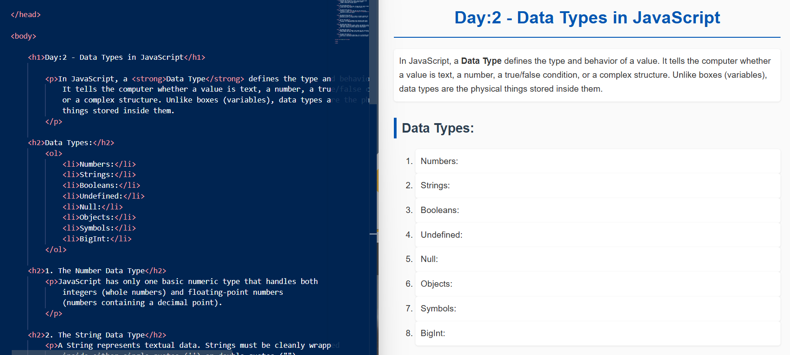
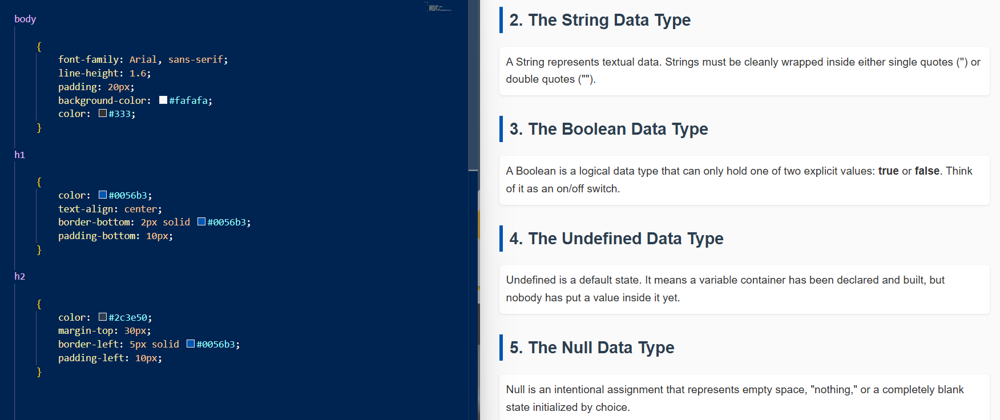
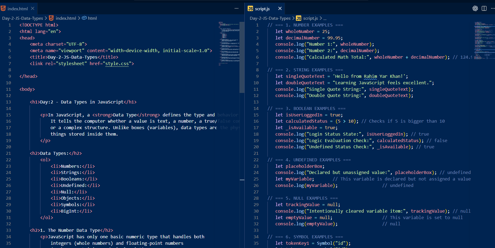
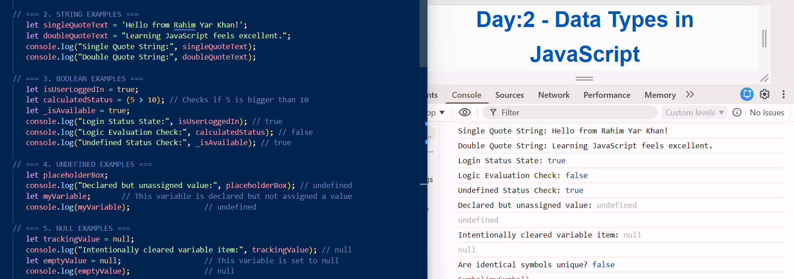

# 📌 Day-2-JS-Data-Types

🌐 **JavaScript Journey (HTML, CSS & JS)**

A clean and organized documentation log showcasing my step-by-step journey through JavaScript fundamentals. This repository serves as a practical codebase timeline, mapping daily topics, hands-on examples, and structural logic from day one onward.

---

### 🚀 About the Project

Before deep diving into advanced frontend logic, my goal is to document every topic day-by-day to track my growth and learning progress.

This specific segment focuses on understanding JavaScript Data Types—defining the structural nature, memory behaviors, and properties of values stored within programming containers.

---

### ✨ Key Features

*   Deep dive into both Primitive and Non-Primitive data classifications
*   Seamless integration of structured markup, customized typography, and external scripts
*   Comprehensive conceptual review of JavaScript's foundational type ecosystem
*   Clean, beginner-friendly explanations with real-world logical comparisons

---

### 🛠️ Tech Stack

**HTML5**
*   Semantic page structure
*   Ordered lists and structured learning outlines

**CSS3**
*   Custom typography and visual layouts
*   Clean font spacing and container styling

**JavaScript**
*   External script modularity
*   Type assignment, console execution, and memory verification testing

---

### 📷 Project Showcase

#### 🎨 Visual Evolution

This section demonstrates the initial structure, styled interface, and code configuration executions.

<table>
  <tr>
    <td><b>1. HTML Structure & Output Preview</b></td>
    <td><b>2. CSS Styled Interface Output</b></td>
  </tr>
  <tr>
    <td></td>
    <td></td>
  </tr>
</table>

<table>
  <tr>
    <td><b>3. HTML & JavaScript Integrated Codebase</b></td>
    <td><b>4. JS Console Logs & Data Output</b></td>
  </tr>
  <tr>
    <td></td>
    <td></td>
  </tr>
</table>
---

### 💻 Development Peek

#### Directory Architecture

```text
JavaScript-Journey/
│
├── Day-1-JS-Introduction/
│   └── ...
│
└── Day-2-JS-Data-Types/
    ├── index.html
    ├── style.css
    ├── script.js
    ├── README.md
    └── assets/images/
        ├── Day-2-html-code-output.png
        ├── Day-2-css-output.png
        ├── Day-2-html-js-code.png
        └── Day-2-jscode-console-output.png

---

#### **Live Demo**:

🔗 Click here to view the live project [  ]

---

### 🌱 My Learning Journey
Having reinforced my HTML and CSS foundations, I have officially launched into JavaScript programming workflows.

I strongly believe that tracking small everyday breakthroughs creates a strong long-term technical foundation.

With consistency, self-belief, and the blessings of Allah, I’m excited to keep growing.

---

### ⭐ Suggestions
If you have any suggestions, improvements, or are also on a similar learning journey, feel free to connect, share ideas, or star this repository.
