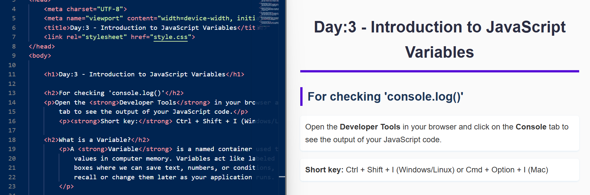
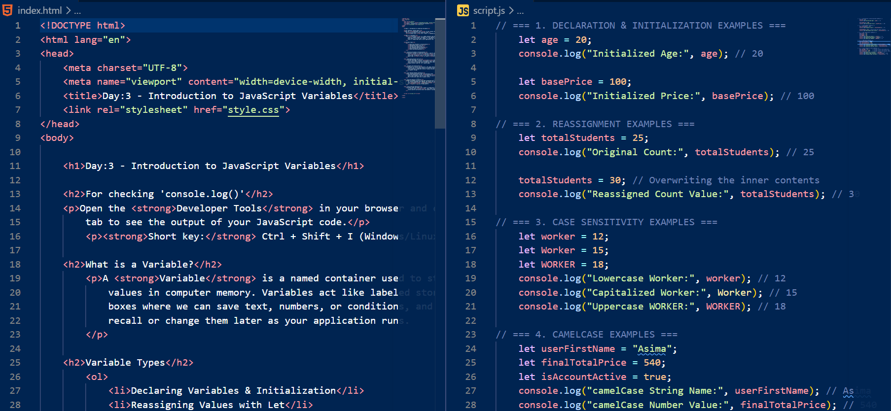
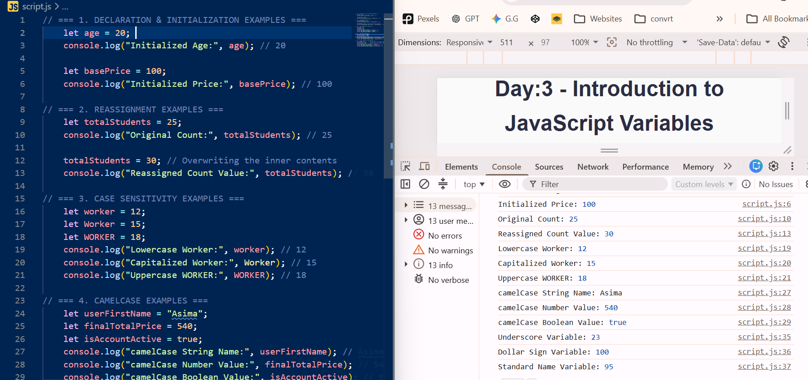
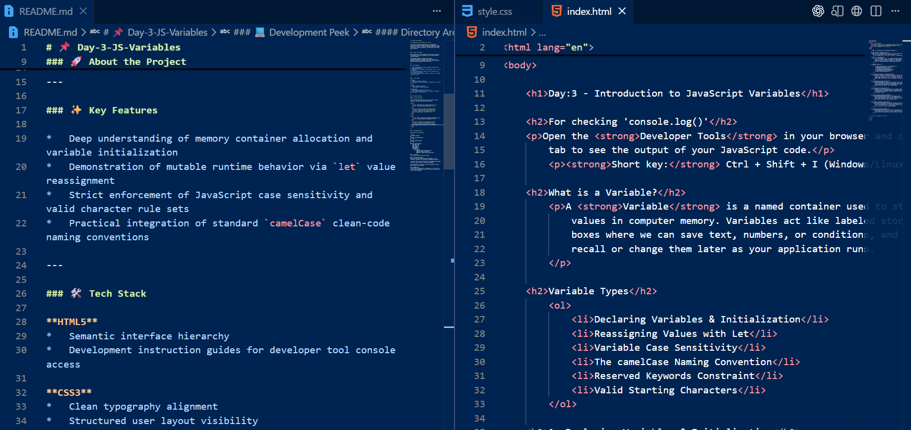

# 📌 Day-3-JS-Variables

🌐 **JavaScript Journey (HTML, CSS & JS)**

A clean and organized documentation log showcasing my step-by-step journey through JavaScript fundamentals. This repository serves as a practical codebase timeline, mapping daily topics, hands-on examples, and structural logic from day one onward.

---

### 🚀 About the Project

Before deep diving into advanced frontend logic, my goal is to document every topic day-by-day to track my growth and learning progress.

This specific segment introduces JavaScript Variables—exploring how named memory containers store, dynamically update, and manage data values while following precise naming regulations and constraints.

---

### ✨ Key Features

*   Deep understanding of memory container allocation and variable initialization
*   Demonstration of mutable runtime behavior via `let` value reassignment
*   Strict enforcement of JavaScript case sensitivity and valid character rule sets
*   Practical integration of standard `camelCase` clean-code naming conventions

---

### 🛠️ Tech Stack

**HTML5**
*   Semantic interface hierarchy
*   Development instruction guides for developer tool console access

**CSS3**
*   Clean typography alignment
*   Structured user layout visibility

**JavaScript**
*   Dynamic data storage logic using `let`
*   Data logging manipulations via the browser environment console layout (`console.log()`)

---

### 📷 Project Showcase

#### 🎨 Visual Evolution

This section demonstrates the initial structure, styled interface, and code configuration executions.

<table>
  <tr>
    <td><b>1. HTML Structure & Output Preview</b></td>
    <td><b>2. HTML & JavaScript Integrated Codebase</b></td>
  </tr>
  <tr>
    <td></td>
    <td></td>
  </tr>
</table>

<table>
  <tr><b>3. JS Console Logs & Data Output</b></td>
    <td><b>4. HTML & README.md Script </b></td>
  </tr>
  <tr>
    <td>
    </td>
    <td></td>
  </tr>
</table>

---

### 💻 Development Peek

#### Directory Architecture

```text
JavaScript-Journey/
│
├── Day-1-JS-Introduction/
│   └── ...
│
├── Day-2-JS-Data-Types/
│   └── ...
│
└── Day-3-JS-Variables/
    ├── index.html
    ├── style.css
    ├── script.js
    ├── README.md
    └── assets/
        └── images/
            ├── Day-3-html-code-output.png
            ├── Day-3-html-js-code.png
            |___ Day-3-html-readme-file.png
            └──Day-3-js-code-console-output.png

### 🚀 Live Demo
🔗 Click here to view the live project

### 🌱 My Learning Journey
Having reinforced my HTML and CSS foundations, I have officially launched into JavaScript programming workflows.

I strongly believe that tracking small everyday breakthroughs creates a strong long-term technical foundation.

With consistency, self-belief, and the blessings of Allah, I’m excited to keep growing.

### ⭐ Suggestions
If you have any suggestions, improvements, or are also on a similar learning journey, feel free to connect, share ideas, or star this repository.
