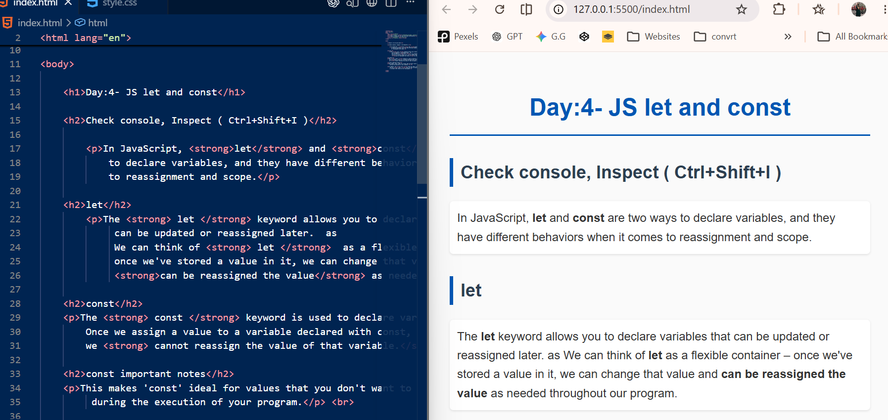
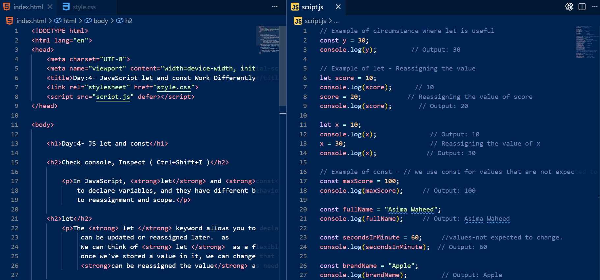
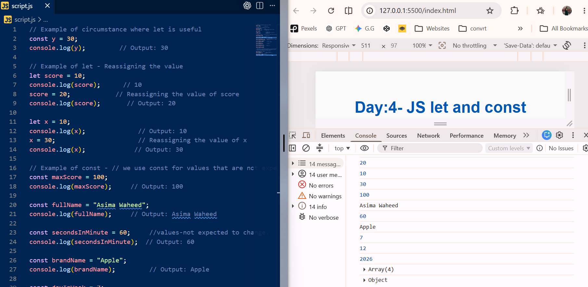

# 📌 DAY-4JS-LET-CONST

🌐 **JavaScript Journey (HTML, CSS & JS)**

A clean and organized documentation log showcasing my step-by-step journey through JavaScript fundamentals. This repository serves as a practical codebase timeline, mapping daily topics, hands-on examples, and structural logic from day one onward.

---

### 🚀 About the Project

Before deep diving into advanced frontend logic, my goal is to document every topic day-by-day to track my growth and learning progress.

This specific segment targets the structural behaviors of variable declaration instruments using `let` and `const`. It explicitly demonstrates the core differences regarding memory value reassignment rules and safe variable protection scopes.

---

### ✨ Key Features

* Comprehensive analysis of mutable data containers using flexible `let` reassignment
* Implementation of immutable strict constants using modern `const` protections
* Detailed review on container tracking limitations regarding primitive data sets
* Advanced evaluation showing how object and array contents remain customizable even under immutable bindings

---

### 🛠️ Tech Stack

**HTML5**
* Semantic page hierarchy
* Explicit instructional documentation for browser developer tool inspection methods

**CSS3**
* Custom structural content separation
* Responsive container paddings and visual type tracking layouts

**JavaScript**
* Dynamic runtime operations and script modularity via the `defer` keyword attribute
* Advanced identifier value configuration monitoring via `console.log()`

---

### 📷 Project Showcase

#### 🎨 Visual Evolution

This section demonstrates the structural layout, codebase distribution, and browser environment runtime console verifications.

<table>
  <tr>
    <td><b>1. HTML Code Structure & Web Layout</b></td>
    <td><b>2. Integrated HTML & Script Codebase</b></td>
  </tr>
  <tr>
    <td></td>
    <td></td>
  </tr>
</table>

<table>
  <tr>
    <td><b>3. JS Execution Engine & Developer Tools Console Logs</b></td>
  </tr>
  <tr>
    <td></td>
  </tr>
</table>

---

### 💻 Development Peek

#### Directory Architecture

```text
JavaScript-Journey/
│
├── Day-1-JS-Introduction/
│   └── ...
│
├── Day-2-JS-Data-Types/
│   └── ...
│
├── Day-3-JS-Variables/
│   └── ...
│
└── DAY-4JS-LET-CONST/
    ├── index.html
    ├── style.css
    ├── script.js
    ├── README.md
    └── assets/
        └── images/
            ├── Day-4-html-code-html-output.png
            ├── Day-4-html-js-code.png
            └── Day-4-js-code-console-output.png

---

<h3>🚀 Live Interactive Preview</h3>

🔗 Explore the Live Demo Link:
 [https://asima-javascript-learning-journey.vercel.app/Day-4-JS-Let-Const/index.html] 

---

<h3>🌱 My Progression Log</h3>

Transitioning from layout designing (HTML/CSS) into core logical programming has been an eye-opening phase. Building these bite-sized daily modules is helping me cement my understanding of script logic from the ground up. 

Staying committed, believing in the process, and relying on the guidance of Allah, I am ready to take on more complex programming challenges ahead.

---

<h3>⭐ Collaborative Feedback</h3>

Whether you are a fellow developer tracking your own progress or have ideas on how I can optimize this code, your inputs are welcome! Drop a suggestion, connect with me, or drop a star to support this daily learning series.
