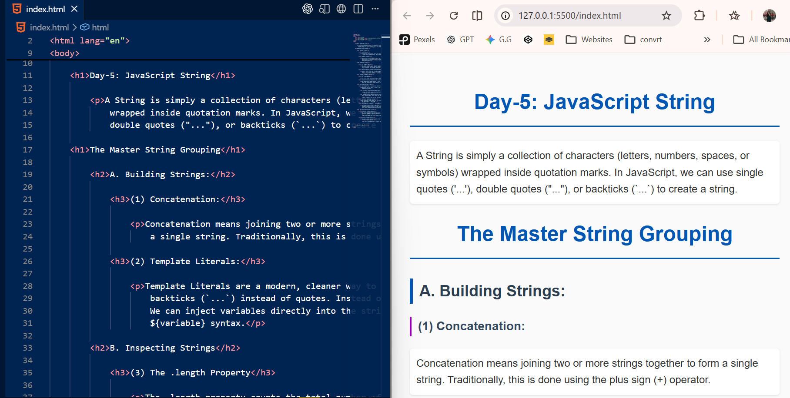
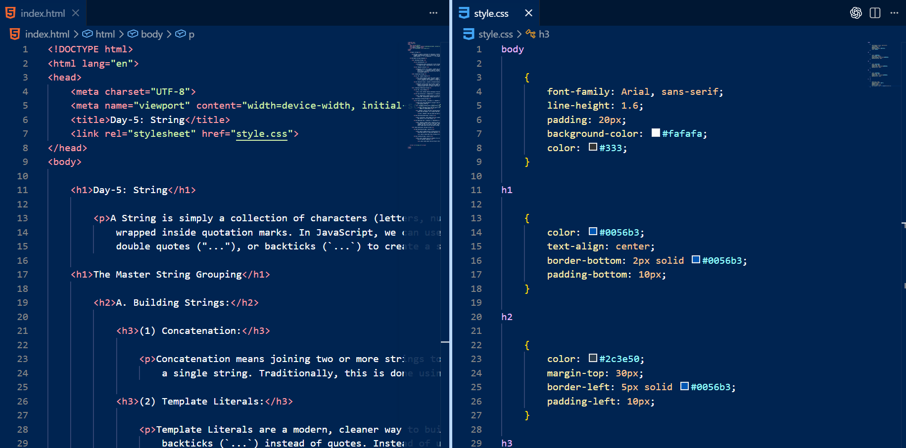
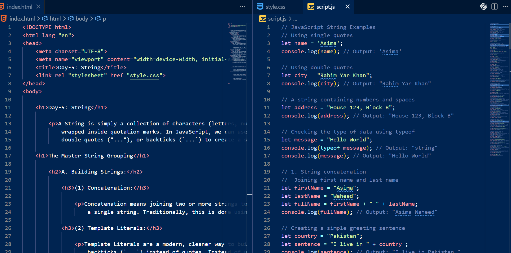
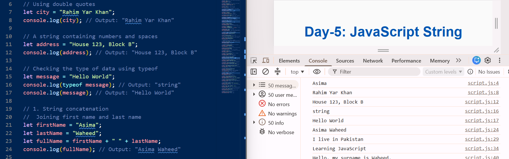

# 📌 Day-5-JS-String

🌐 **JavaScript Journey (HTML, CSS & JS)**

A clean and organized documentation log showcasing my step-by-step journey through JavaScript fundamentals. This repository serves as a practical codebase timeline, mapping daily topics, hands-on examples, and structural logic from day one onward.

---

### 🚀 About the Project

Before deep diving into advanced frontend logic, my goal is to document every topic day-by-day to track my growth and learning progress.

This specific segment delivers an in-depth breakdown of the Master String Grouping in JavaScript. It explores text data initialization, inspection mechanisms, cleaning techniques, search algorithms, substring extractions, and bidirectional conversions between strings and arrays.

---

### ✨ Key Features

* **Building & Literals:** Mastering variable injection via modern backtick template literals over standard concatenation hooks.
* **Inspecting & Accessing:** Utilizing structural `.length` tracking alongside index-based character lookup methodologies.
* **Text Manipulation:** Global text swapping and trimming methods to safely process input parameters.
* **Data Conversion:** Splitting structural data strings down into individual array components and reconstructing them cleanly via joining strings.

---

### 🛠️ Tech Stack

**HTML5**
* Semantic text classification blocks and deep structural page groupings
* Explicit inline guide tags mapping shortcut keys for developer tooling access

**CSS3**
* Modern element alignment and customized visual text formatting
* Sleek document presentation styling to balance readable text outputs

**JavaScript**
* Comprehensive string properties, native parsing logic, and variable manipulation chains
* Global compilation testing using the runtime diagnostic console utility (`console.log()`)

---

### 📷 Project Showcase

#### 🎨 Visual Evolution

This section demonstrates the structural layout, codebase distribution, and browser environment runtime console verifications.

<table>
  <tr>
    <td><b>1. HTML Code Output & Documentation Preview</b></td>
    <td><b>2. HTML & CSS Structured Layout Code</b></td>
  </tr>
  <tr>
    <td></td>
    <td></td>
  </tr>
</table>

<table>
  <tr>
    <td><b>3. Integrated HTML & JavaScript Source Layout</b></td>
    <td><b>4. JS Engine Computations & Console Log Details</b></td>
  </tr>
  <tr>
    <td></td>
    <td></td>
  </tr>
</table>

---

### 💻 Development Peek

#### Directory Architecture

```text
JavaScript-Journey/
│
├── Day-1-JS-Introduction/
│   └── ...
│
│    Day-2-JS-Data-Types/
│   └── ...
│
│    Day-3-JS-Variables/
│   └── ...
│
├── DAY-4-JS-Let-Const/
│   └── ...
│
└── Day-5-JS-String/
    ├── index.html
    ├── style.css
    ├── script.js
    ├── README.md
    └── assets/
        └── images/
            ├── Day-5-html-code-output.png
            ├── Day-5-html-css-code.png
            ├── Day-5-html-js-code.png
            └── Day-5-js-code-console-output.png 

---

<h3>🚀 Live Interface Deployment</h3>

🔗 [Launch the live interactive build on Vercel]
()

---

🔗 Click here to view the complete JavaScript-Journey Repository: [https://github.com/asima-waheed/JavaScript-Journey]

---

<h3>🌱 My Tech Progression</h3>

Stepping into string methods marks an exciting step forward from static styling into functional computational logic. Systematically log-keeping these core concepts day-by-day is providing me with immense clarity over data behavior inside the browser.

By maintaining high dedication, expanding my analytical vision, and leaning on the blessings of Allah, I feel energized to keep leveling up my engineering mindset.

---

<h3>⭐ Community Collaboration</h3>

If you are a fellow tech explorer following a parallel pathway or have insights on structural code optimization, let's keep in touch! Feel free to leave an improving tip, establish a network connection, or star this learning repository to show your support.