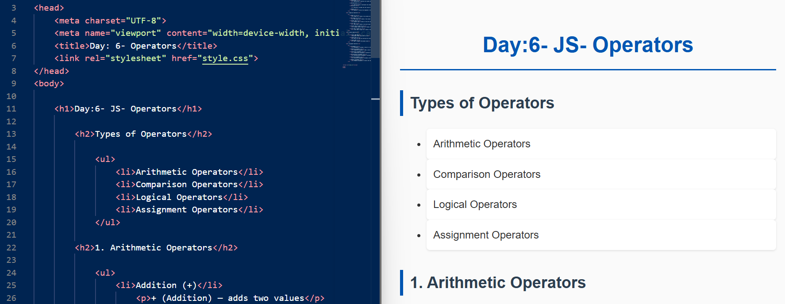
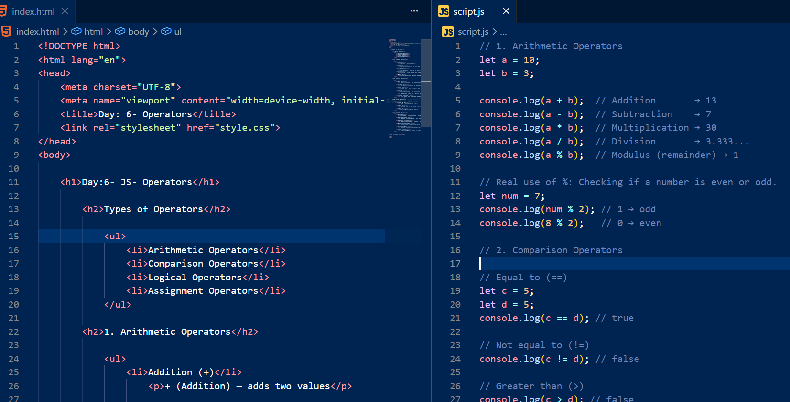
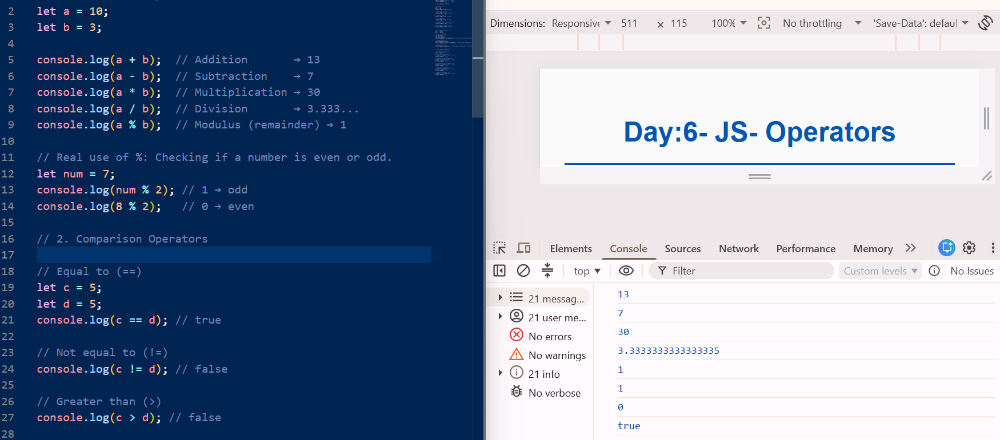

# 📌 Day-6-JS-Operators

🌐 **JavaScript Journey (HTML & JS Core Processing)**

A structured structural repository tracking my progression through foundational coding logic. This folder acts as a dedicated log segment for handling functional variables, numeric properties, conditional algorithms, and assignment operations within the local execution engine.

---

### 🚀 Technical Overview

Transitioning from text methods, this module deep dives directly into operational logic blocks. By creating a unified directory for different types of operators, this challenge focuses on executing calculation chains, evaluating variable equations, verifying data parameters, and testing continuous value adjustments in the local dev pipeline.

---

### ✨ Core Features

* **Mathematical Computations:** Processing arithmetic structures like mod calculations (`%`) alongside addition and division layers.
* **Boolean Comparisons:** Running data evaluation logic to check true/false variables using equity benchmarks and boundary ranges.
* **Conditional Intersections:** Implementing logical gate chains (`&&`, `||`, `!`) to test multi-layered verification rules simultaneously.
* **Variable Modifications:** Utilizing short-form mathematical assignments (`+=`, `*=`, `%=`) to rapidly process database or memory properties.

---

### 🛠️ Environment Configuration

**HTML5**
* Unordered list index structures maps to categorize system processing groups
* Formatted paragraph description nodes providing clear insight into engine symbols

**JavaScript**
* Functional evaluation algorithms running structural arithmetic and value comparisons
* Live diagnostic debugging via the active evaluation window context (`console.log()`)

---

### 📷 Documented Proof

#### 🎨 Layout and Evaluation Results

This section displays the front-end layout structural code, the side-by-side source editor distribution, and the resulting engineering logs rendered inside the dev tool inspect panel.

<table>
  <tr>
    <td><b>1. Document Structure & Output View</b></td>
    <td><b>2. Combined HTML & JS Script Workspace</b></td>
  </tr>
  <tr>
    <td></td>
    <td></td>
  </tr>
  <tr>
    <td colspan="2" align="center">
      <b>3. Active Terminal Computations & Dev Console Engine Logs</b><br>
      
    </td>
  </tr>
</table>

---

### 💻 Directory Mapping

#### Project Folder Tree

```text
JavaScript-Journey/
|
|── Day-1-JS-Introduction/
│   └── ...
|
|── Day-2-JS-Data-Types/
│   └── ...
|
── Day-3-JS-Variables/
│   └── ...
|
── Day-4-JS-Let-Const/
│   └── ...
│
├── Day-5-JS-String/
│   └── ...
│
└── Day-6-JS-Operators/
    ├── index.html
    ├── style.css
    ├── script.js
    ├── README.md
    └── assets/
        └── images/
            ├── Day-6-html-browser-output.png
            ├── Day-6-html-js-code.png
            └── Day-6-js-console-output.png 

---

🔗 View the active interactive project deployment on Vercel

#### Learning Outcomes

Exploring calculations and logical gates has provided me with real clarity on how algorithms filter information and execute updates under the hood. Translating these equations into clean scripts confirms that small, deliberate structural blocks form the backing of complex platforms.

If you are tracking a similar technical route or have constructive optimization guidelines regarding efficient operational structures, let's exchange some insights! Please drop a helpful comment, reach out to connect profiles, or star this log history to stay updated.