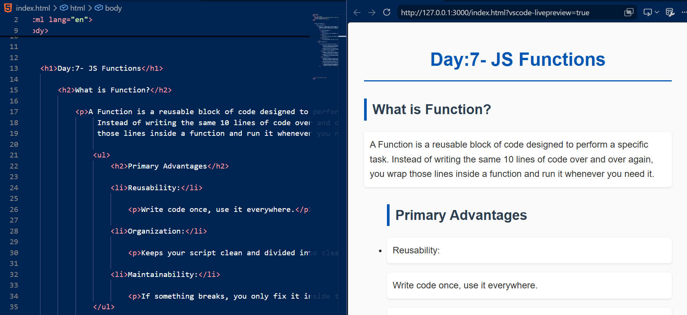
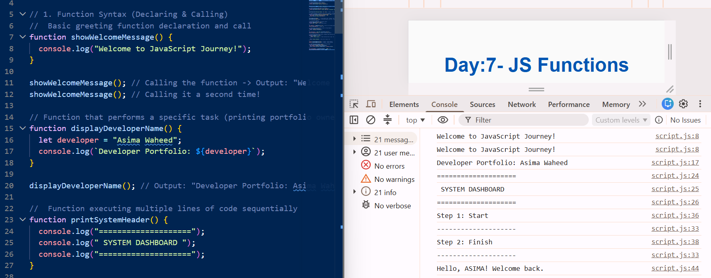
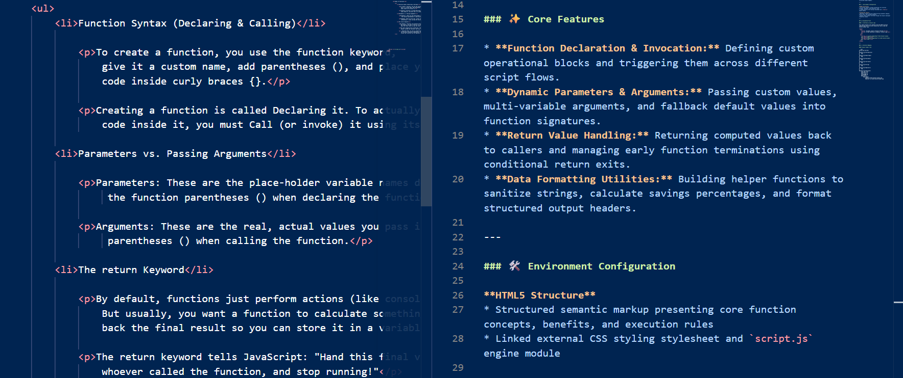

# 📌 Day-7-JS-Functions

🌐 **JavaScript Journey (Modular Logic & Reusable Functions)**

A specialized repository section focused on mastering JavaScript functions, code modularity, and reusable logic blocks. This folder serves as an execution log for understanding function declarations, parameter passing, return statements, and clean algorithmic structure.

---

### 🚀 Technical Overview

Transitioning from conditional operators, Day 7 explores the heart of functional programming in JavaScript. By grouping lines of code into callable units, this module demonstrates how to write modular, maintainable, and DRY (Don't Repeat Yourself) code to execute dynamic scripts efficiently.

---

### ✨ Core Features

* **Function Declaration & Invocation:** Defining custom operational blocks and triggering them across different script flows.
* **Dynamic Parameters & Arguments:** Passing custom values, multi-variable arguments, and fallback default values into function signatures.
* **Return Value Handling:** Returning computed values back to callers and managing early function terminations using conditional return exits.
* **Data Formatting Utilities:** Building helper functions to sanitize strings, calculate savings percentages, and format structured output headers.

---

### 🛠️ Environment Configuration

**HTML5 Structure**
* Structured semantic markup presenting core function concepts, benefits, and execution rules
* Linked external CSS styling stylesheet and `script.js` engine module

**JavaScript Logic**
* Multiple custom functions demonstrating parameter mapping, return flow, and fallback defaults
* Dynamic data outputs verified through the browser developer inspection window

---

### 📷 Documented Proof

#### 🎨 Interface & Console Logs

This table displays the rendered front-end DOM structure side-by-side with the active JavaScript source code and console output logs.

<table>
  <tr>
    <td><b>1. Document Layout & Browser Preview</b></td>
    <td><b>2. Script Execution & Inspector Console Logs</b></td>
  </tr>
  <tr>
    <td></td>
    <td></td>
  </tr>
  <tr>
    <td colspan="2" align="center">
      <b>3. HTML Markup & Repository Markdown Code Workspace</b><br>
      
    </td>
  </tr>
</table>

---

### 💻 Directory Mapping

#### Project Folder Tree

```text
JavaScript-Journey/
│
├── Day-1-JS-Introduction/
│   └── ...
│
├── Day-2-JS-Data-Types/
│   └── ...
│
├── Day-3-JS-Variables/
│   └── ...
│
├── Day-4-JS-Let-Const/
│   └── ...
│
├── Day-5-JS-String/
│   └── ...
│
├── Day-6-JS-Operators/
│   └── ...
│
└── Day-7-JS-Functions/
    ├── index.html
    ├── style.css
    ├── script.js
    ├── README.md
    └── assets/
        └── images/
            ├── Day-7-html-browser-output.png
            └── Day-7-js-code-console-output.png

---

<h3>🚀 Live Interface Deployment</h3>

🔗 [Experience the production deployment on Vercel](https://asima-javascript-journey.vercel.app)

---

<h3>🌱 My Dev Progression</h3>

Mastering JS functions represents a critical leap from simple linear scripts to modular, reusable architecture. Documenting each breakdown daily gives me deep technical clarity on how scope, parameters, and return outputs operate under the hood.

With focused execution, continuous effort, and the constant blessings of Allah, I am thrilled to keep expanding my core software engineering skillset.

---

<h3>⭐ Suggestions & Community Engagement</h3>

If you have optimization suggestions, code refinements, or are currently navigating a similar web development path, I’d love to connect! Feel free to share your thoughts, reach out to exchange technical ideas, or star this repository to follow along with my learning milestones.