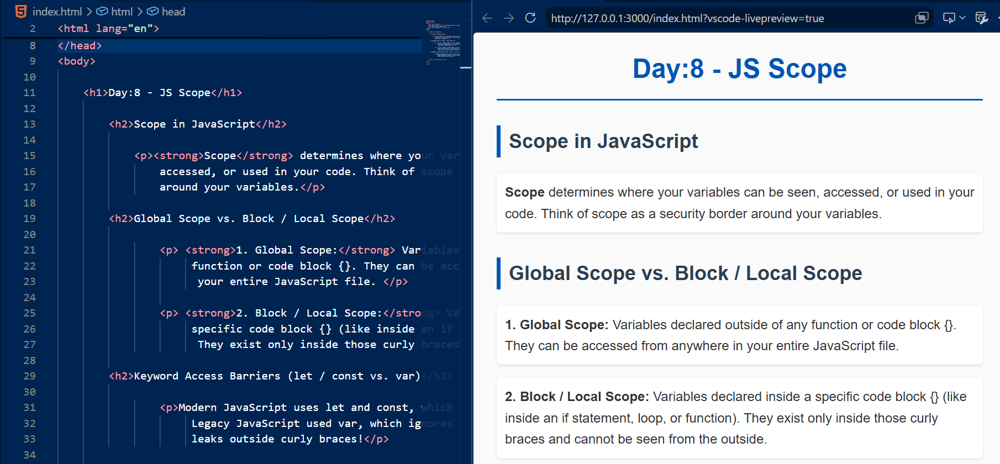
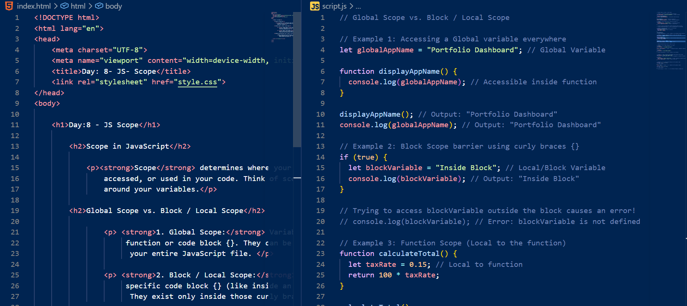
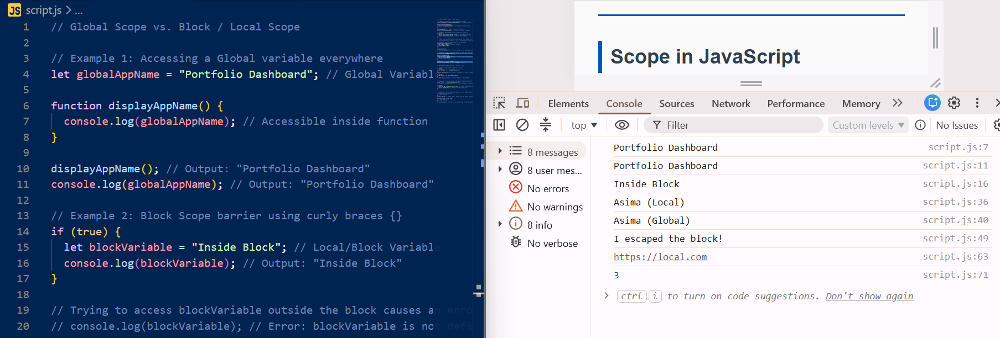
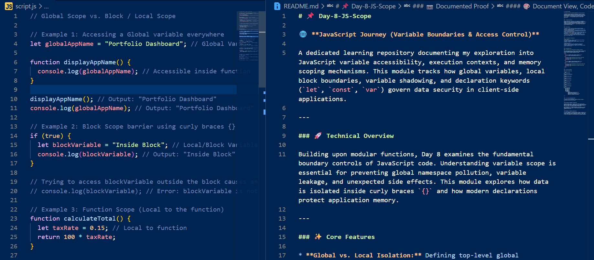

# 📌 Day-8-JS-Scope

🌐 **JavaScript Journey (Variable Boundaries & Access Control)**

A dedicated learning repository documenting my exploration into JavaScript variable accessibility, execution contexts, and memory scoping mechanisms. This module tracks how global variables, local block boundaries, variable shadowing, and declaration keywords (`let`, `const`, `var`) govern data security in client-side applications.

---

### 🚀 Technical Overview

Building upon modular functions, Day 8 examines the fundamental boundary controls of JavaScript code. Understanding variable scope is essential for preventing global namespace pollution, variable leakage, and unexpected side effects. This module explores how data is isolated inside curly braces `{}` and how modern declarations protect application memory.

---

### ✨ Core Features

* **Global vs. Local Isolation:** Defining top-level global references alongside block-scoped local variables confined inside functions or conditional blocks.
* **Variable Shadowing Dynamics:** Managing scenarios where locally declared variables temporarily override globally scoped identifiers within a localized block context.
* **Declaration Keyword Leakage Check:** Comparing modern block-level declarations (`let` and `const`) against legacy function-scoped declarations (`var`) to identify memory leakage risks.
* **Loop Variable Cleanup:** Demonstrating how iteration counters (`let` vs `var`) exist safely within loop execution boundaries or leak into the global scope.

---

### 🛠️ Environment Configuration

**HTML5 Layout**
* Structured conceptual headings breaking down security borders, scope types, and keyword access rules
* External stylesheet linkage alongside modular runtime script invocation (`script.js`)

**JavaScript Logic**
* Multi-scenario variable access experiments testing block boundaries, shadow overrides, and constant reassignments
* Explicit diagnostic evaluation logged directly through developer browser console instances

---

### 📷 Documented Proof

#### 🎨 Document View, Code Structure & Inspector Terminal

This section showcases the rendered front-end DOM, the side-by-side script development workspace, active browser console execution outputs, and the workspace documentation layout.

<table>
  <tr>
    <td><b>1. Document Layout & Browser Preview</b></td>
    <td><b>2. HTML & Script Workspace Setup</b></td>
  </tr>
  <tr>
    <td></td>
    <td></td>
  </tr>
  <tr>
    <td><b>3. Inspector Console Evaluation Logs</b></td>
    <td><b>4. README Documentation Workspace</b></td>
  </tr>
  <tr>
    <td></td>
    <td></td>
  </tr>
</table>

---

### 💻 Directory Mapping

#### Project Folder Tree

```text
JavaScript-Journey/
│
├── Day-1-JS-Introduction/
│   └── ...
│
├── Day-2-JS-Data-Types/
│   └── ...
│
├── Day-3-JS-Variables/
│   └── ...
│
├── Day-4-JS-Let-Const/
│   └── ...
│
├── Day-5-JS-String/
│   └── ...
│
├── Day-6-JS-Operators/
│   └── ...
│
├── Day-7-JS-Functions/
│   └── ...
│
└── Day-8-JS-Scope/
    ├── index.html
    ├── style.css
    ├── script.js
    ├── README.md
    └── assets/
        └── images/
            ├── Day-8-html-browser-output.png
            ├── Day-8-html-js-code.png
            ├── Day-8-js-code-console-output.png
            └── Day-8-js-readme-structure.png

---

---

<h3>🚀 Live Project Deployment</h3>

🔗 [Access the active deployment instance on Vercel] (https://asima-javascript-journey.vercel.app)

---

<h3>🌱 Technical Takeaways & Growth</h3>

Grasping variable scope is a massive step toward writing secure, bug-free web applications. Realizing how `var` escapes block barriers while `let` and `const` strictly guard variable lifetimes gives me strong confidence in managing data memory efficiently.

With continuous focus, structured practice, and relying on Allah’s endless blessings, I am eager to keep building deeper technical competencies every day.

---

<h3>⭐ Feedback & Community Connect</h3>

If you have feedback on code optimization, variable architecture, or are also documenting your software engineering path, I would love to connect! Feel free to leave a suggestion, reach out to share ideas, or star this repository to follow along with my learning milestones.