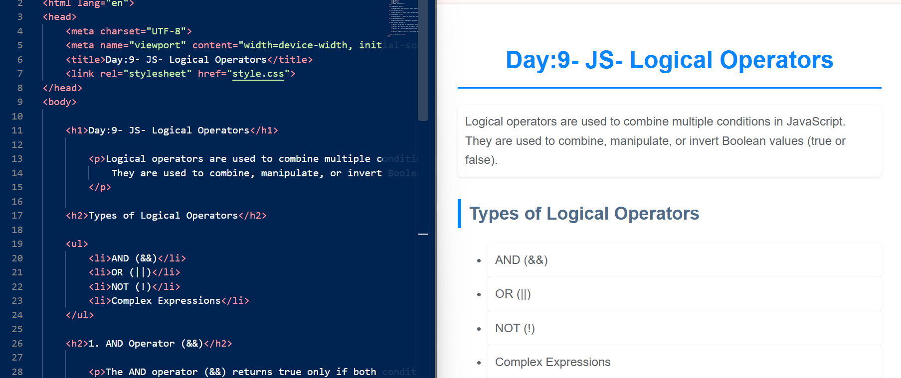
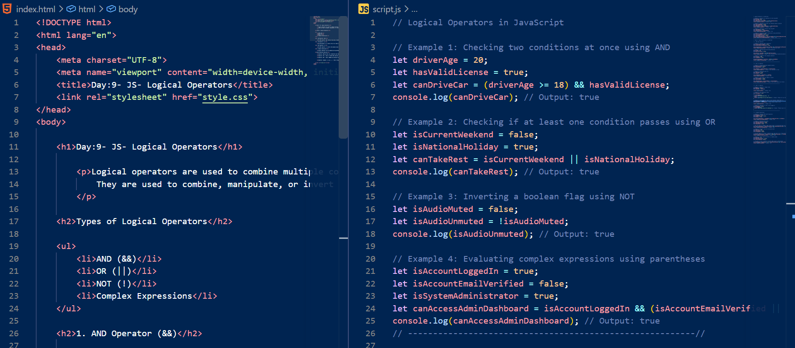
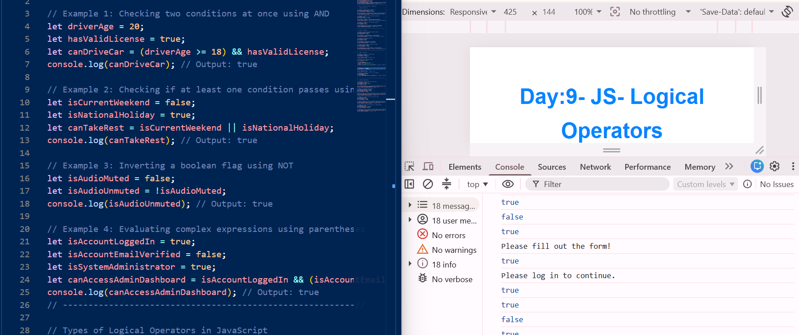
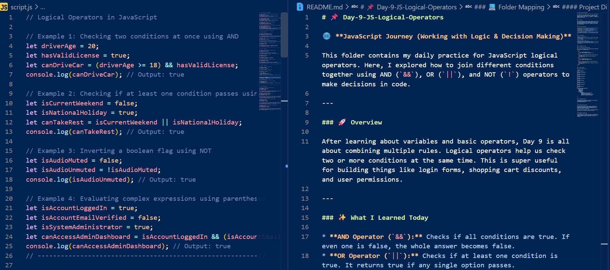

# 📌 Day-9-JS-Logical-Operators

🌐 **JavaScript Journey (Working with Logic & Decision Making)**

This folder contains my daily practice for JavaScript logical operators. Here, I explored how to join different conditions together using AND (`&&`), OR (`||`), and NOT (`!`) operators to make decisions in code.

---

### 🚀 Overview

After learning about variables and basic operators, Day 9 is all about combining multiple rules. Logical operators help us check two or more conditions at the same time. This is super useful for building things like login forms, shopping cart discounts, and user permissions.

---

### ✨ What I Learned Today

* **AND Operator (`&&`):** Checks if all conditions are true. If even one is false, the whole answer becomes false.
* **OR Operator (`||`):** Checks if at least one condition is true. It returns true if any single option passes.
* **NOT Operator (`!`):** Reverses a boolean value. It flips `true` to `false` and `false` to `true`.
* **Grouping with Parentheses `()`:** Using brackets to control which condition gets checked first when writing complex logic.

---

### 🛠️ File Details

**HTML File (`index.html`)**
* Simple text structure listing logical operator types and easy rules to remember.
* Links to the external CSS file and connects the `script.js` file at the bottom.

**JavaScript File (`script.js`)**
* Real-world examples like checking user login info, calculating shipping discounts, and handling payment choices.
* All outputs are printed cleanly to the browser console using `console.log()`.

---

### 📷 Screenshots & Proof

#### 🎨 Output Views & Workspace Setup

Here are the screenshots of my web page preview, VS Code editor, console outputs, and README setup.

<table>
  <tr>
    <td><b>1. Web Page Display</b></td>
    <td><b>2. HTML & JavaScript Workspace</b></td>
  </tr>
  <tr>
    <td></td>
    <td></td>
  </tr>
  <tr>
    <td><b>3. Console Output Logs</b></td>
    <td><b>4. README Setup Workspace</b></td>
  </tr>
  <tr>
    <td></td>
    <td></td>
  </tr>
</table>

---

### 💻 Folder Mapping

#### Project Directory Tree

```text
JavaScript-Journey/
│
├── Day-1-JS-Introduction/
│   └── ...
│
├── Day-2-JS-Data-Types/
│   └── ...
│
├── Day-3-JS-Variables/
│   └── ...
│
├── Day-4-JS-Let-Const/
│   └── ...
│
├── Day-5-JS-String/
│   └── ...
│
├── Day-6-JS-Operators/
│   └── ...
│
├── Day-7-JS-Functions/
│   └── ...
│
├── Day-8-JS-Scope/
│   └── ...
│
└── Day-9-JS-Logical-Operators/
    ├── index.html
    ├── style.css
    ├── script.js
    ├── README.md
    └── assets/
        └── images/
            ├── Day-9-html-browser-output.png
            ├── Day-9-html-js-code.png
            ├── Day-9-js-code-console-output.png
            └── Day-9-js-readme-structure.png

---

---

<h3>🚀 Live Demo Link</h3>

🔗 [Check out my live project on Vercel]( https://github.com/asima-waheed/JavaScript-Journey/tree/main/Day-9-JS-Logical-Operators )


---

<h3>🌱 Personal Progress</h3>

Practicing logical operators showed me how web apps actually make decisions behind the scenes. Learning how to group conditions using brackets helped me understand how to write cleaner logic without creating bugs.

With daily practice and Allah's help, I am slowly getting more comfortable with writing pure JavaScript every day!

---

<h3>⭐ Feedback & Connect</h3>

If you have any tips to improve this code or if you are also learning JavaScript, I would love to connect with you! Feel free to leave a comment, share your suggestions, or star this repository.